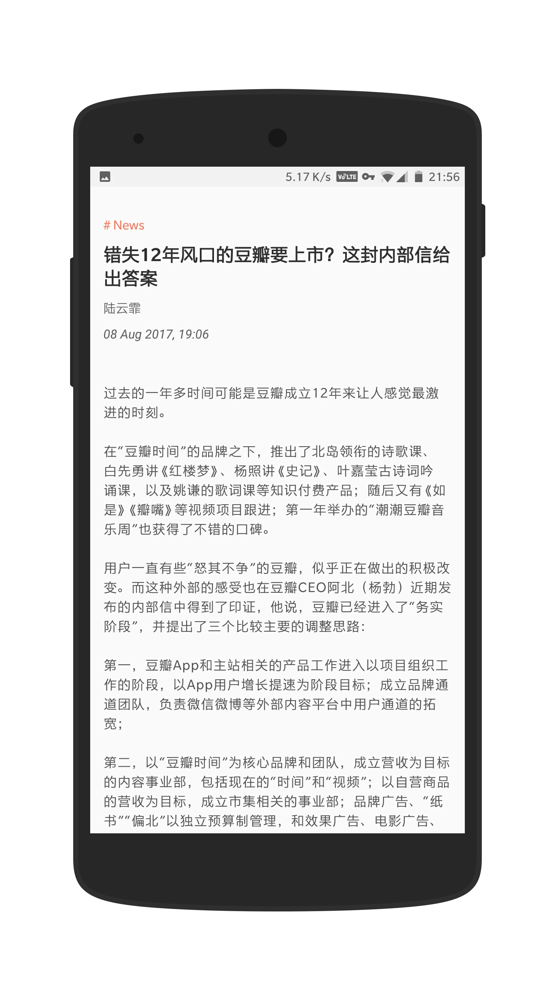

## Aequorea

> Aequorea 是一类多管水母。

很喜欢一财的文章，但是一财的APP不太好用，所以就自己写了一个，暂时只完成了基本功能。

因为是非官方的所以就不上市场了，可以到 [Release](https://github.com/nichbar/Aequorea/releases) 里下载最新的安装包。

### Feature 

* 轻量级的第三方一财客户端
* 遵循Material Design设计
* 数据来源于第一财经周刊
* 无推送无广告

### Preview

### Thanks

- [RxJava](https://github.com/ReactiveX/RxJava)
- [RxAndroid](https://github.com/ReactiveX/RxAndroid)
- [OkHttp](https://github.com/square/okhttp)
- [Retrofit](https://github.com/square/retrofit)
- [Gson](https://github.com/google/gson)
- [ButterKnife](https://github.com/JakeWharton/butterknife)
- [RichText](https://github.com/zzhoujay/RichText)
- [MySplash](https://github.com/WangDaYeeeeee/Mysplash)
